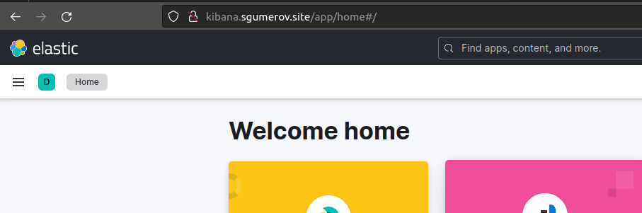
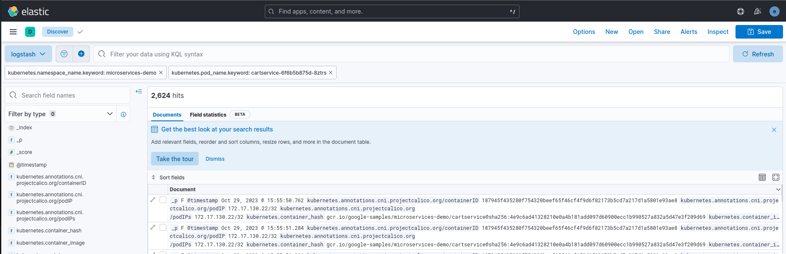
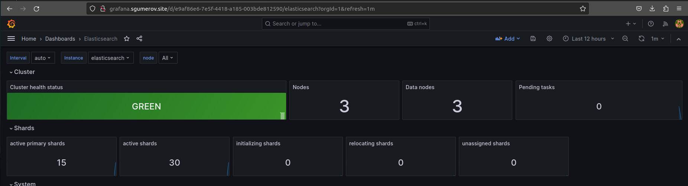
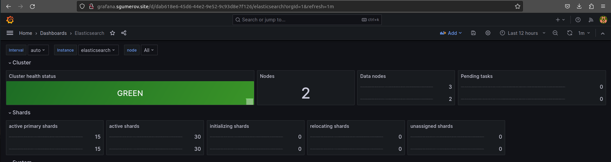
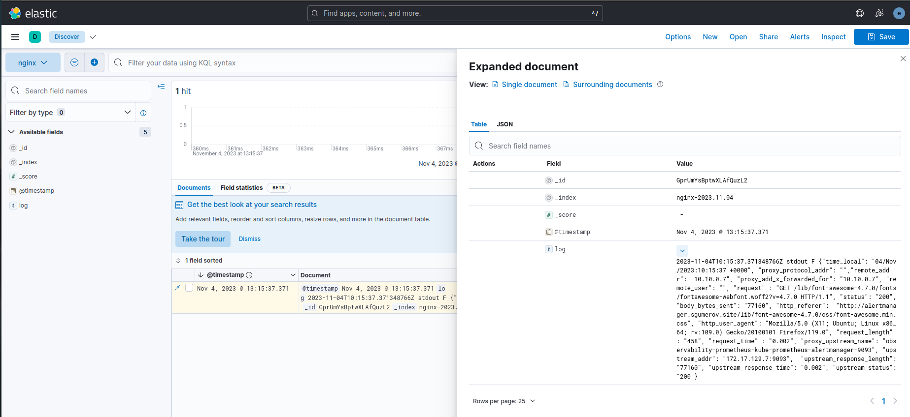
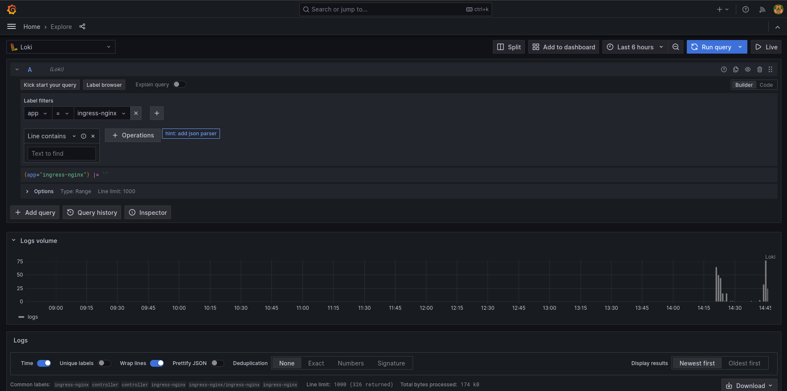

# Сервисы централизованного логирования для компонентов Kubernetes и приложений

Т.к. предложенные методические указания для выполнения работы сильно устарели, некоторые моменты задания будут выполняться по своей методике  

## Подготовка Kubernetes кластера

Кластер разворачивается при помощи подхода IAC (terraform и gitlab-ci) из [репозитория](https://gitlab.com/shamrockoo4tune/iac-for-kubernetes-gitops)
по [инструкции](https://gitlab.com/shamrockoo4tune/iac-for-kubernetes-gitops/-/blob/master/instructions.md?ref_type=heads)    

Присвоение лейблов и тейнтов производится на этапе создания в terraform манифесте

```bash
$ k get nodes -l pool -o custom-columns=NAME:.metadata.name,POOL-LABEL:.metadata.labels.pool,TAINTS:.spec.taints 
NAME                        POOL-LABEL   TAINTS
cl1bb8fsa36a2cuipnfm-otaz   default      <none>
cl1kba62cviv944bbb2e-iquj   infra        [map[effect:NoSchedule key:node-role value:infra]]
cl1kba62cviv944bbb2e-onit   infra        [map[effect:NoSchedule key:node-role value:infra]]
cl1kba62cviv944bbb2e-ywij   infra        [map[effect:NoSchedule key:node-role value:infra]]
```

<br>  

## Установка HipsterShop

Неймспейс  
```bash
$ k create ns microservices-demo
namespace/microservices-demo created
```

Установка hipster shop  
Сначала скачиваем и правим манифест

```bash
$ wget \
  https://raw.githubusercontent.com/express42/otus-platform-snippets/master/Module-02/Logging/microservices-demo-without-resources.yaml \
  -O microservices-demo.yaml

$ k apply \
  -f microservices-demo.yaml \
  -n microservices-demo
```
Проверяем что все поды развернулись на ноде из default pool:
```bash
$ k get pods -n microservices-demo -o wide
```
<br>  

## Установка EFK стека | Helm charts

```bash
$ k create ns observability
namespace/observability created
```

Чарты не выкачиваются, поэтому скачиваем релиз с github и устанавливаем из локального чарта с подправленным values:  
```bash
$ wget https://github.com/elastic/helm-charts/archive/refs/tags/v8.5.1.tar.gz -O v8.5.1.tar.gz
$ tar -xzf v8.5.1.tar.gz

$ helm upgrade --install elasticsearch ./helm-charts-8.5.1/elasticsearch -n observability -f elasticsearch.values.yaml

# Убедиться в поднятии кластера es
$ k -n observability get pods -o wide -l chart=elasticsearch
NAME                     READY   STATUS    RESTARTS   AGE   IP             NODE                        NOMINATED NODE   READINESS GATES
elasticsearch-master-0   1/1     Running   0          12m   172.17.130.3   cl1kba62cviv944bbb2e-onit   <none>           <none>
elasticsearch-master-1   1/1     Running   0          12m   172.17.128.3   cl1kba62cviv944bbb2e-iquj   <none>           <none>
elasticsearch-master-2   1/1     Running   0          12m   172.17.131.3   cl1kba62cviv944bbb2e-ywij   <none>           <none>
```  

<br>  

## Установка nginx-ingress | Самостоятельное задание

Создаем [кастомный values для ingress-nginx](../kubernetes-logging/ingress-nginx.values.yaml)
Устанавливаем **ingress-nginx**

```bash
$ helm upgrade --install ingress-nginx ingress-nginx \
  --repo https://kubernetes.github.io/ingress-nginx \
  -n ingress-nginx \
  --create-namespace \
  -f ingress-nginx.values.yaml 

# Проверка запуска
$ k -n ingress-nginx get pods -o wide
NAME                                        READY   STATUS    RESTARTS   AGE     IP             NODE                        NOMINATED NODE   READINESS GATES
ingress-nginx-controller-7fd56c46dd-g58hc   1/1     Running   0          2m12s   172.17.131.4   cl1kba62cviv944bbb2e-ywij   <none>           <none>
ingress-nginx-controller-7fd56c46dd-kf7lh   1/1     Running   0          91s     172.17.128.4   cl1kba62cviv944bbb2e-iquj   <none>           <none>
ingress-nginx-controller-7fd56c46dd-wbjks   1/1     Running   0          111s    172.17.130.4   cl1kba62cviv944bbb2e-onit   <none>           <none>
```  

<br>  

## Установка EFK стека | Kibana

Подготовка [values файла](../kubernetes-logging/kibana.values.yaml)  
Установка чарта:  
```bash
$ helm upgrade --install kibana ./helm-charts-8.5.1/kibana -n observability -f kibana.values.yaml
```

Получение логина и пароля для входа в **kibana**:
```bash
$ k -n observability get secrets elasticsearch-master-credentials -o yaml
...
data:
  password: <base64 закодированный пароль>
  username: ZWxhc3RpYw==
...

$ echo 'ZWxhc3RpYw==' | base64 -d
elastic

$ echo '<base64 закодированный пароль>' | base64 -d
<раскодированный пароль>
```

Проверка:  
```bash
$ k -n observability get pods -o wide
NAME                             READY   STATUS    RESTARTS   AGE   IP             NODE                        NOMINATED NODE   READINESS GATES
elasticsearch-master-0           1/1     Running   0          22m   172.17.128.3   cl1b3fsav4ldj0ck2iv6-asev   <none>           <none>
elasticsearch-master-1           1/1     Running   0          22m   172.17.131.3   cl1b3fsav4ldj0ck2iv6-ymod   <none>           <none>
elasticsearch-master-2           1/1     Running   0          22m   172.17.129.3   cl1b3fsav4ldj0ck2iv6-ujyx   <none>           <none>
kibana-kibana-59788f5547-7kjf7   1/1     Running   0          16m   172.17.129.5   cl1b3fsav4ldj0ck2iv6-ujyx   <none>           <none>
```

Перейти на URL указанный в ингресе values файла **kibana**:
  

<br>  

## Fluent Bit

Вписать пароль эластика/кибаны в [fluent-bit.values.yaml](../kubernetes-logging/fluent-bit.values.yaml) и установить:  
```bash
$ helm upgrade --install fluent-bit fluent/fluent-bit -n observability -f fluent-bit.values.yaml

$ k -n observability get pods
NAME                             READY   STATUS    RESTARTS   AGE
elasticsearch-master-0           1/1     Running   0          92m
elasticsearch-master-1           1/1     Running   0          92m
elasticsearch-master-2           1/1     Running   0          92m
fluent-bit-7pzmj                 1/1     Running   0          9s
fluent-bit-nbjhl                 1/1     Running   0          9s
fluent-bit-qp425                 1/1     Running   0          9s
fluent-bit-xk9nf                 1/1     Running   0          9s
kibana-kibana-59788f5547-7kjf7   1/1     Running   0          85m
```

Проверка:  
  

Проблема с дублирующими полями не воспроизводится  

<br>  

## Мониторинг ElasticSearch

```bash
$ helm repo add prometheus-community https://prometheus-community.github.io/helm-charts

$ helm upgrade --install prometheus prometheus-community/kube-prometheus-stack -n observability -f prometheus-operator.values.yaml
```

Экспортер эластика:
```bash
$ helm upgrade --install elasticsearch-exporter prometheus-community/prometheus-elasticsearch-exporter -n observability -f prometheus-elasticsearch-exporter.values.yaml --atomic

$ k -n observability get pods
NAME                                                              READY   STATUS    RESTARTS      AGE
alertmanager-prometheus-kube-prometheus-alertmanager-0            2/2     Running   2 (37m ago)   40m
elasticsearch-exporter-prometheus-elasticsearch-exporter-5qpzp4   1/1     Running   0             22s
elasticsearch-master-0                                            0/1     Running   1 (37m ago)   173m
elasticsearch-master-1                                            0/1     Running   1 (37m ago)   173m
elasticsearch-master-2                                            0/1     Running   1 (37m ago)   173m
fluent-bit-69spc                                                  0/1     Running   1 (37m ago)   57m
fluent-bit-grvx8                                                  1/1     Running   1 (37m ago)   57m
fluent-bit-sr7gq                                                  0/1     Running   1 (37m ago)   57m
fluent-bit-z97cf                                                  1/1     Running   1 (37m ago)   57m
kibana-kibana-59788f5547-7kjf7                                    0/1     Running   1 (37m ago)   167m
prometheus-grafana-77b5554dc9-c9nd6                               3/3     Running   3 (37m ago)   40m
prometheus-kube-prometheus-operator-8cdb954c6-xm8q5               1/1     Running   1 (37m ago)   40m
prometheus-kube-state-metrics-7f8f5686d8-lsnwx                    1/1     Running   1 (37m ago)   40m
prometheus-prometheus-kube-prometheus-prometheus-0                2/2     Running   2 (37m ago)   40m
prometheus-prometheus-node-exporter-bhksw                         1/1     Running   1 (37m ago)   40m
prometheus-prometheus-node-exporter-hcsrx                         1/1     Running   1 (37m ago)   40m
prometheus-prometheus-node-exporter-xk2gt                         1/1     Running   1 (37m ago)   40m
```

Устанавливаем [дашбоард для мониторинга elasticsearch](https://grafana.com/grafana/dashboards/4358) в **grafana**  
  

Проверка отказоустойчивости:
```bash
$ k drain cl1b3fsav4ldj0ck2iv6-asev --ignore-daemonsets --delete-emptydir-data
node/cl1b3fsav4ldj0ck2iv6-asev already cordoned
Warning: ignoring DaemonSet-managed Pods: kube-system/calico-node-bmj5x, kube-system/ip-masq-agent-vjqv9, kube-system/kube-proxy-cqtkg, kube-system/npd-v0.8.0-hwfz8, kube-system/yc-disk-csi-node-v2-2zk5b, observability/fluent-bit-69spc, observability/prometheus-prometheus-node-exporter-xk2gt
evicting pod observability/prometheus-kube-prometheus-operator-8cdb954c6-xm8q5
evicting pod observability/elasticsearch-exporter-prometheus-elasticsearch-exporter-6pb7s2
evicting pod ingress-nginx/ingress-nginx-controller-7fd56c46dd-269pm
evicting pod observability/elasticsearch-master-0
evicting pod observability/prometheus-grafana-77b5554dc9-c9nd6
pod/prometheus-grafana-77b5554dc9-c9nd6 evicted
pod/prometheus-kube-prometheus-operator-8cdb954c6-xm8q5 evicted
pod/elasticsearch-master-0 evicted
pod/ingress-nginx-controller-7fd56c46dd-269pm evicted
pod/elasticsearch-exporter-prometheus-elasticsearch-exporter-6pb7s2 evicted
node/cl1b3fsav4ldj0ck2iv6-asev drained
```  

  

Снятие кордона:  
```bash
$ k uncordon cl1b3fsav4ldj0ck2iv6-asev
```  

<br>  

## Логи nginx-ingress

Для получения логов ингресса в kibana, нужно добавить изменения в values файлы fluent-bit:
```yaml
    [INPUT]
        Name              tail
        Tag               nginx.*
        Path              /var/log/containers/ingress-nginx-controller*.log
        Parser            docker, cri
        Mem_Buf_Limit     5MB
        Skip_Long_Lines   On
...
    [OUTPUT]
        Name               es
        Match              nginx.*
        Host               elasticsearch-master
        Logstash_Format    On
        Logstash_Prefix    nginx
        Retry_Limit        False
        tls                On
        tls.verify         Off
        http_user          elastic
        http_passwd        <токен>
        Suppress_Type_Name On
```

В values ingress-nginx: 
```yaml
config: 
    log-format-escape-json: "true"
    log-format-upstream: '{"time_local": "$time_local", "proxy_protocol_addr": "$proxy_protocol_addr","remote_addr": "$remote_addr", "proxy_add_x_forwarded_for":     "$proxy_add_x_forwarded_for", "remote_user": "$remote_user", "request" : "$request", "status": "$status", "body_bytes_sent": "$body_bytes_sent", "http_referer":  "$http_referer", "http_user_agent": "$http_user_agent", "request_length" : "$request_length", "request_time" : "$request_time",
        "proxy_upstream_name": "$proxy_upstream_name", "upstream_addr": "$upstream_addr",  "upstream_response_length": "$upstream_response_length",
        "upstream_response_time": "$upstream_response_time", "upstream_status": "$upstream_status"}'
```  

  

<br>  

## Loki

Установка:
```bash
$ helm repo add grafana https://grafana.github.io/helm-charts
$ helm repo update
$ helm upgrade --install loki grafana/loki-stack \
    -n observability \
    -f loki.values.yaml \
    --atomic

$ helm upgrade --install prometheus prometheus-community/kube-prometheus-stack \
    -n observability \
    -f prometheus-operator.values.yaml \
    --atomic
```  
Добавляем data source в grafana: http://loki:3100  
Проверка:
  

serviceMonitor для Nginx:  
```bash
$ helm upgrade --install ingress-nginx ingress-nginx/ingress-nginx \
  -n ingress-nginx \
  -f ingress-nginx.values.yaml
```  

А вот что делать дальше - как ни пытался понять ни х. не понял (
  