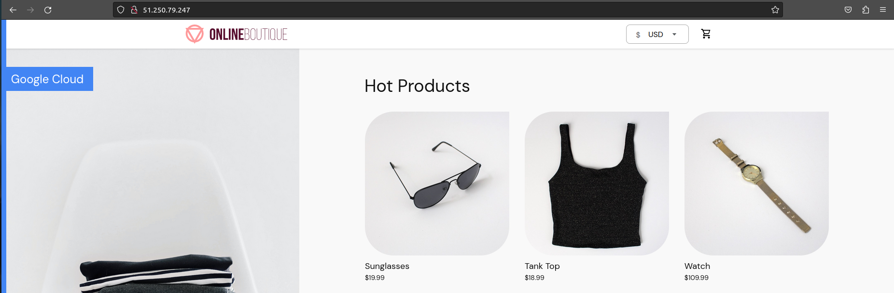

# GitOps и инструменты поставкипоставки

Кодовая база ДЗ раскидана по нескольком репозиториям:  
|Название репо            |Ссылка                                                        |Назначение                                |  
|:------------------------|:-------------------------------------------------------------|:-----------------------------------------|  
|ShamrockOo4tune_platform |https://github.com/otus-kuber-2023-08/ShamrockOo4tune_platform|Основной репозиторий с домашними заданиями|  
|microservices-demo       |https://gitlab.com/shamrockoo4tune/microservices-demo         |Репозиторий с демо приложениями           |  
|microservices-demo-cd    |https://gitlab.com/shamrockoo4tune/microservices-demo-cd      |Helm чарты для демо приложений            |  
|iac-for-kubernetes-gitops|https://gitlab.com/shamrockoo4tune/iac-for-kubernetes-gitops  |Кластер k8s - инфраструктура как код      |  

## GitLab

Репозиторий с копией приложения: [microservices-demo](https://gitlab.com/shamrockoo4tune/microservices-demo)   
Dockerfiles приложений были дополнены утилитой **grpc_health_probe** для реализации probes  

<br>  

## Создание Helm чартов

[Helm charts](https://gitlab.com/shamrockoo4tune/microservices-demo-cd) были скопированы из [демонстрационного репозитория](https://gitlab.com/express42/kubernetes-platform-demo/microservices-demo/) и немного подрихтованы  

<br>

## Подготовка Kubernetes кластера | задание со ⭐

Кластер подготовлен в YC, раскатка производится terraform из [gitlab-ci пайплайна](https://gitlab.com/shamrockoo4tune/iac-for-kubernetes-gitops/-/blob/master/.gitlab-ci.yml) инфраструктурного репо

<br>

## Continuous Integration

Собрал и поместил в Docker Hub образы приложений с тегами на основе семантических версий:
  

<br>

## Continuous Integration | задание со ⭐

Написал написал пайплайн для сборки новых образов приложений с тэгом по хешу коммита или по git tag - если есть.   
CI запускается только для тех сервисов, в директориях с которыми были измененеия  
  
  

<br>

## Пререквизиты

1. nginx-ingress
```bash
$ helm upgrade --install ingress-nginx ingress-nginx \
   --repo https://kubernetes.github.io/ingress-nginx \
   --namespace ingress-nginx --create-namespace
``` 
2. cert-manager
```bash
$ helm repo add jetstack https://charts.jetstack.io
$ helm repo update  
$ k apply -f https://github.com/cert-manager/cert-manager/releases/download/v1.13.2/cert-manager.crds.yaml
$ helm install cert-manager jetstack/cert-manager \
    --namespace cert-manager \
    --create-namespace \
    --version v1.13.2
```
3. ClusterIssuer 
```bash
$ k apply -f kubernetes-templating/chartmuseum/cluster-issuer.yaml 
```

## GitOps

Задание с flux из методички описывает работу с deprecated первой версией тула, поэтому его пропускаю.  
Воспроизводить логику буду на argocd   

### ArgoCD
1. Устанавливаем по [официальной документации](https://argo-cd.readthedocs.io/en/stable/getting_started/)
   ```bash
   $ k create namespace argocd
   $ k apply -n argocd -f https://raw.githubusercontent.com/argoproj/argo-cd/stable/manifests/install.yaml
   ```
2. Создаем [правило ингресса](/kubernetes-gitops/argocd_ingress_rule.yaml)  
   ```bash
   $ kubectl apply -f argocd_ingress_rule.yaml
   ```
4. Установка ArgoCD cli  
  Согласно [официальной документации](https://argo-cd.readthedocs.io/en/stable/cli_installation/) 
   ```bash
   $ curl -sSL -o argocd-linux-amd64 https://github.com/argoproj/argo-cd/releases/latest/download/argocd-linux-amd64
   $ chmod u+x argocd-linux-amd64
   $ sudo mv argocd-linux-amd64 /usr/local/bin/argocd
   ```
5. Логин и смена пароля
   ```bash
   $ argocd admin initial-password -n argocd
   <пароль>
  
   $ argocd login argocd.sgumerov.site
   WARNING: server certificate had error: x509: certificate is valid for ingress.local, not argocd.shamrockoo4tune.ru. Proceed insecurely (y/n)? y
   WARN[0009] Failed to invoke grpc call. Use flag --grpc-web in grpc calls. To avoid this warning message, use flag --grpc-web. 
   Username: admin
   Password: 
   'admin:login' logged in successfully
   Context 'argocd.sgumerov.site' updated

   $ argocd account update-password
   WARN[0000] Failed to invoke grpc call. Use flag --grpc-web in grpc calls. To avoid this warning message, use flag --grpc-web. 
   *** Enter password of currently logged in user (admin): 
   *** Enter new password for user admin: 
   *** Confirm new password for user admin: 
   Password updated
   Context 'argocd.sgumerov.site' updated
   ```
6. Применяем ресурсы [AppProject](/kubernetes-gitops/project.yaml) и  манифесты Application для приложений
   ```bash
   $ k apply -f kubernetes-gitops/project.yaml 
   $ k apply -f kubernetes-gitops/frontend-application.yaml 
   $ k apply -f kubernetes-gitops/emailservice-applicaton.yaml
   $ k apply -f kubernetes-gitops/adservice-application.yaml 
   $ k apply -f kubernetes-gitops/cartservice-application.yaml 
   $ k apply -f kubernetes-gitops/checkoutservice-application.yaml 
   $ k apply -f kubernetes-gitops/currencyservice-application.yaml 
   $ k apply -f kubernetes-gitops/loadgenerator-application.yaml 
   $ k apply -f kubernetes-gitops/paymentservice-application.yaml 
   $ k apply -f kubernetes-gitops/productcatalogservice-application.yaml 
   $ k apply -f kubernetes-gitops/recommendationservice-application.yaml 
   $ k apply -f kubernetes-gitops/shippingservice-application.yaml 
   ```
7. Наблюдаем UI ArgoCD
     

8. Идем в магазин
   
   
<br>

### Настройка автоматики CD 

При пуше нового тэга инициализируется CI пайплайн  
  
который после сборки и публикации образов коммитит новые версии чартов в CD репо  

далее, новый тэг подхватывает argocd  
  

Удаляем объекты argocd и весь namespace для исключения интерференции при работе с другими инструментами.  

<br>  

## Canary deployments с Flagger и Istio

### Установка istio при помощи istioctl
```bash
$ istioctl install --set profile=demo -y
```  

<br>

### Установка Istio | Задание со ⭐  

Удаление istio установленного ранее  
```bash
$ istioctl uninstall --purge
```  

### Установка istio helm chart
```bash
$ helm repo add istio https://istio-release.storage.googleapis.com/charts
$ helm repo update
$ helm install istio-base istio/base -n istio-system --set defaultRevision=default --create-namespace

# проверка установки базовых сущностей (CRD): 
$ helm ls -n istio-system
NAME            NAMESPACE       REVISION        UPDATED                                 STATUS          CHART           APP VERSION
istio-base      istio-system    1               2023-11-05 23:34:05.973106623 +0300 MSK deployed        base-1.19.3     1.19.3

# Установка дискавери чарта, который будет устанавливать istiod:
$ helm install istiod istio/istiod \
  -f kubernetes-gitops/istiod.values.yaml \
  -n istio-system \
  --wait

# istio-ingressgateway
$ helm install istio-ingressgateway istio/gateway \
  -n istio-ingress \
  -f kubernetes-gitops/istio-gateway.values.yaml \
  --create-namespace

# prometheus
$ k apply -f https://raw.githubusercontent.com/istio/istio/release-1.19/samples/addons/prometheus.yaml
```  

<br>

### Установка flagger  
```bash
$ helm repo add flagger https://flagger.app
$ k apply -f https://raw.githubusercontent.com/weaveworks/flagger/master/artifacts/flagger/crd.yaml
$ helm upgrade --install flagger flagger/flagger \
    -n istio-system \
    -f kubernetes-gitops/flagger.values.yaml
```

Изменим маркировку namespace с приложением для istion sidecar injection:  
```bash
$ k edit ns microservices-demo
$ k get ns microservices-demo --show-labels
NAME                 STATUS   AGE    LABELS
microservices-demo   Active   2d3h   istio-injection=enabled,kubernetes.io/metadata.name=microservices-demo,project=shop
```

Переустановим микросервисные приложения в microservices-demo неймспеэсе и проверим привязку сайдкаров istio:  
```bash
$ k describe pod -l app=frontend -n microservices-demo
...
...
  Normal  Started    3m58s  kubelet            Started container istio-proxy
```  

<br> 

## Доступ к frontend 

Чтобы настроить маршрутизацию трафика к приложению с использованием Istio, необходимо добавить [ресурсы](/kubernetes-gitops/play_with_flagger/deploy/istio/) (frontend-vs.yaml, frontend-gw.yaml)  

Также предварительно (при установке istio в кластер) должен быть создан ресурс istio-ingressgateway   

Проверяем его наличие:
```bash
$ k get svc istio-ingressgateway -n istio-ingress
NAME                   TYPE           CLUSTER-IP       EXTERNAL-IP     PORT(S)                                      AGE
istio-ingressgateway   LoadBalancer   172.18.148.128   51.250.79.247   15021:31121/TCP,80:32704/TCP,443:30117/TCP   15h
```
Его создание вызовет создание внешнего (облачного балансировщика)  
Теперь в shop можно зайти по http://\<EXTERNAL-IP\>  
    

Для экспериментов с flagger и istio изменим ресолвинг shop.sgumerov.site на IP нового балансировщика   

<br>

## Istio | Самостоятельное задание

Переносим ресурсы istio frontend-vs.yaml, frontend-gw.yaml в [чарты фронтэнда](https://gitlab.com/shamrockoo4tune/microservices-demo-cd/-/tree/main/deploy/charts/frontend) т.к. они логически являются частью инфраструктурного кода, описывающего окружение микросервиса frontend    
файлы c именами  
- gateway.yaml  
- virtualService.yaml  

И проверяем сайт:  
  

<br>

## Flagger | Canary
Создаем и применяем [манифест с canary](https://gitlab.com/shamrockoo4tune/microservices-demo-cd/-/tree/main/deploy/charts/frontend/templates/canary.yaml)  

Убеждаемся что проинициализирован:  
```bash
$ kubectl get canary -n microservices-demo
NAME       STATUS         WEIGHT   LASTTRANSITIONTIME
frontend   Initializing   0        2023-11-06T12:50:29Z
```
Убеждаемся что canary добавил постфиксы подам фронтэнда:
```bash
$ kubectl get pods -n microservices-demo -l app=frontend-primary
NAME                                READY   STATUS    RESTARTS   AGE
frontend-primary-65ff68585c-drx28   2/2     Running   0          66s
```
Обновляем приложение до следующего тэга и после продолжительных перенастроек istio и flagger, наконец то:  
    
