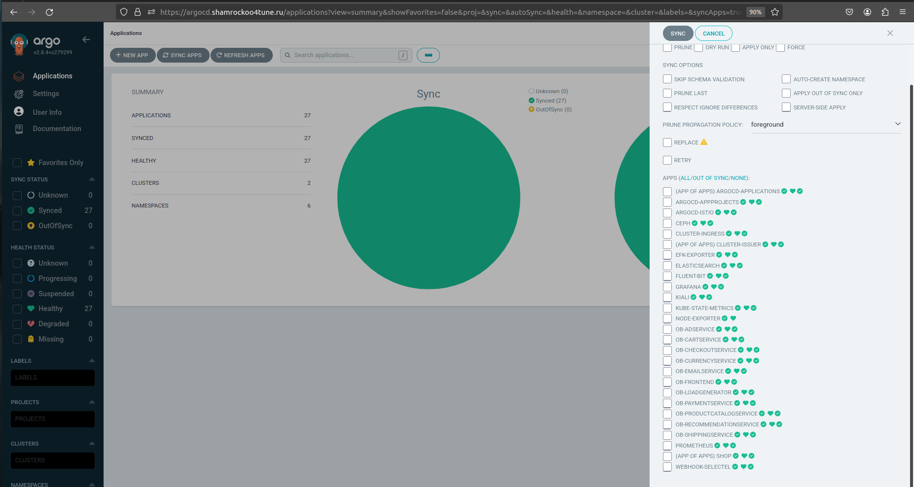
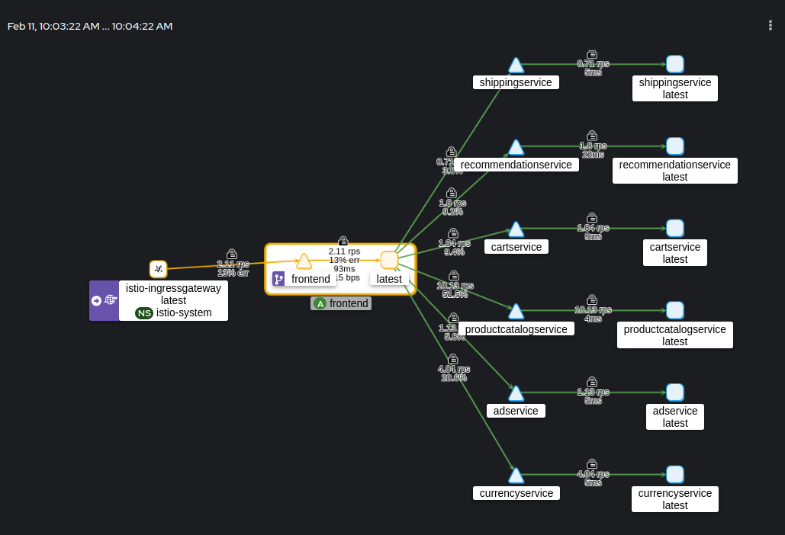
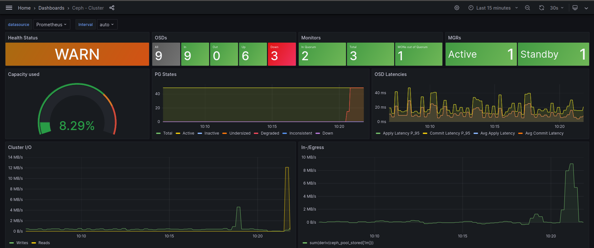

# Курсовая работа

Инфраструктурная платформа на основе kubernetes

## Тема  

Инфраструктурная self-managed k8s платформа с элементами высокодоступности и 
отказоустойчивости узлов плоскости управления и отказоустойчивой инфраструктурой 
подсистемы хранения данных.  

---

<br>  

## Содержание

1.  [Описание платформы](./16_27_kubernetes_project.MD#1-описание-платформы)  
2.  [Доменные имена и инфраструктура](./16_27_kubernetes_project.MD#2-доменные-имена)  
3.  [Репозитории](./16_27_kubernetes_project.MD#3-репозитории)  
4.  [Создание инфраструктуры](./16_27_kubernetes_project.MD#4-создание-инфраструктуры)  
5.  [Получение доступа к кластеру](./16_27_kubernetes_project.MD#5-получение-доступа-к-кластеру)  
6.  [Ингресс в кластер](./16_27_kubernetes_project.MD#6-ингресс-в-кластер)  
7.  [TLS сертификаты](./16_27_kubernetes_project.MD#7-tls-сертификаты)  
8.  [Демо приложение](./16_27_kubernetes_project.MD#8-демо-приложение)  
9.  [Gitops - ArgoCD](./16_27_kubernetes_project.MD#9-gitops---argocd)  
10. [Персистентность данных](./16_27_kubernetes_project.MD#10-персистентность-данных)  
11. [Observability](./16_27_kubernetes_project.MD#11-observability)  
12. [Отказоустойчивость системы](./16_27_kubernetes_project.MD#12-отказоустойчивость-системы)  
13. [Включение и выключение системы](./16_27_kubernetes_project.MD#13-включение-и-выключение-системы)  

---

<br>  

## 1. Описание платформы

Платформа будет состоять из self-managed кластера k8s, состоящего из 3х master 
нод и трех worker нод, развернутая в облаке Yandex cloud.  

Развертывание инфраструктуры будет производиться с использованием iac 
инструмента Terraform. Автоматизированное развертыание из публичного 
репозитория с использованием CI сервиса gitlab.com.  

Вся инфраструктура будет размещаться в приватных сетях, без выделения внешних IP
адресов для нод кластера. Точками входа будут выступать bastion (jump) хост и 
облачные балансировщики.  

Подсистема хранения будет развернута на базе внешнего (по отношению к самому 
k8s) кластера Ceph.  

Создание кластеров k8s и Ceph будет производиться с использованием iac подхода 
при помощи инструмента Ansible.  

Высокой доступности и отказоустойчивости класера планируется достигнуть за счет 
балансирования трафика на облачном L3/L4 балансировщике.  

Сетевая подсистема будет основана на плагине Calico.  

В качестве нагрузки будет использовано микросервисное приложение-пример 
Hipster Shop.  
Деплой и CD приложения в кластер будет производится с использованием подхода 
git-ops при помощи инструмента ArgoCD.  

Доступ трафика в кластер будет производится через virtual service ингресса 
технологии Istio.  

Observability: мониторинг, алертинг на базе технологий prometheus - grafana,  
логирование - EFK.  

<br>  

## 2. Доменные имена и инфраструктура

Для реализации проекта был зарезервирован домен shamrockoo4tune.ru
Используются ДНС А записи которые разрешаются в IP адреса облачных 
балансировщиков.  

|fqdn                  |nslookup     |назначение                    |  
|----------------------|-------------|------------------------------|  
|k8s.shamrockoo4tune.ru|130.193.51.65|доступа к kube-api серверу    |  
|*.shamrockoo4tune.ru  |158.160.61.9 |ингресс к приложениям кластера|  

Управление зоной делегировано на сервера Selectel т.к. там такая услуга 
предоставляется без взимания дополнительной платы.  

Основная инфраструктура развернута в Яндекс облаке и размещается в различных
зонах доступности.  

##### Группы хостов и отдельные виртуальные машины  

| имя                   | тип                   |      внутренний FQDN       |  public IP  | private IP  |  датацентр  |  
|-----------------------|-----------------------|----------------------------|-------------|-------------|-------------|  
|bastion                |джамп хост             |bastion.ru-central1.internal|динамический |192.168.10.3 |ru-central1-a|  
|ceph1                  |сервер кластера ceph   |ceph1.ru-central1.internal  | -           |192.168.10.20|ru-central1-a|  
|ceph2                  |сервер кластера ceph   |ceph2.ru-central1.internal  | -           |192.168.20.11|ru-central1-b|  
|ceph3                  |сервер кластера ceph   |ceph3.ru-central1.internal  | -           |192.168.30.26|ru-central1-d|  
|platform-api           |облачный балансировщик | -                          |130.193.51.65| -           | -           |
|platform-ingress       |облачный балансировщик | -                          |158.160.61.9 | -           | -           |
|master1                |плоскость управления   |master1.ru-central1.internal| -           |192.168.10.11|ru-central1-a|  
|master2                |плоскость управления   |master2.ru-central1.internal| -           |192.168.20.7 |ru-central1-b|  
|master3                |плоскость управления   |master3.ru-central1.internal| -           |192.168.30.20|ru-central1-d|  
|shamrock004tune-tfstate|s3 хранилище состояния | -                          | -           |             |             |    
|shamrock004tune-tfstate|YDB БД блокировок s3   | -                          | -           |             |             |  
|worker1                |сервер рабочих нагрузок|worker1.ru-central1.internal| -           |192.168.10.23|ru-central1-a|  
|worker2                |сервер рабочих нагрузок|worker2.ru-central1.internal| -           |192.168.20.29|ru-central1-b|  
|worker3                |сервер рабочих нагрузок|worker3.ru-central1.internal| -           |192.168.30.20|ru-central1-d|  

##### Типовые конфигурации виртуальных машин

|тип вм | платформа |CPU|RAM|SSD / HDD |образ ОС    |    
|-------|-----------|---|---|----------|------------|  
|bastion|standard-v2| 2 | 4 |HDD 1 x 20|Ubuntu 20.04|  
|ceph   |standard-v2| 2 | 4 |SSD 3 x 16|Debian 11   |  
|master |standard-v2| 2 | 4 |HDD 1 x 20|Ubuntu 20.04|  
|worker |standard-v2| 4 | 8 |HDD 1 x 20|Ubuntu 20.04|  

<br>  

## 3. Репозитории

Код проекта хранится в публичных репозиториях  

|платформа|назначение                             | URL                                                          |  
|---------|---------------------------------------|--------------------------------------------------------------|  
|DockerHub|Образы контейнеризированных приложений |https://hub.docker.com/repositories/shamrockoo4tune           |  
|GitHub   |IAC, документация, основной репозиторий|https://github.com/otus-kuber-2023-08/ShamrockOo4tune_platform|  
|GitLab   |зеркало основного репо, CICD           |https://gitlab.com/shamrockoo4tune/platform-project           |  
|Gitlab   |Helm чарты демо приложения, CD         |https://gitlab.com/shamrockoo4tune/microservices-demo-cd      |  
|GitLab   |Код демо микросервисов, CI             |https://gitlab.com/shamrockoo4tune/microservices-demo         |  

##### Секреты и переменные для развертывания 

Секреты, пароли и токены хранятся в виде секретов платформ репозиториев  

|имя                           |тип       |назначение                               |  
|------------------------------|----------|-----------------------------------------|  
|ARGOCD_ADMIN_PASSWORD         |переменная|пароль администратора ArgoCD             |  
|ARTIFACT_ENCRYPTION_PASSPHRASE|переменная|пароль шифрования артефактов CICD        |  
|AWS_ACCESS_KEY_ID             |переменная|ID статического ключа доступа в YC       |  
|AWS_SECRET_ACCESS_KEY         |переменная|секретный ключ доступа к ресурсам YC     |  
|SELECTEL_API_TOKEN            |переменная|Токен для управления DNS зоной в Selectel|  
|TFVARS                        |файл      |Переменные для terraform                 |  
|YC_KEY                        |файл      |Файл-ключ доступа к ресурсам YC          |  

##### Содержание TFVARS

```hcl
cloud_id             = "< отредактировано >"
folder_id            = "< отредактировано >"
image_id             = "fd8s4a9mnca2bmgol2r8"
image_id_storages    = "fd85an6q1o26nf37i2nl"
sa_key_file_path     = "/home/anduser/yc-terraform/key.json"
zone                 = "ru-central1-a"
```  

Параметризация развертывания производится через редактирование файлов 
[terraform.tfvars](../kubernetes-project/terraform/terraform.tfvars.example), 
[.gitlab-ci.yml](../.gitlab-ci.yml) и многочисленных конфигурационных файлов 
сценариев ansible в каталогах [ceph](../kubernetes-project/ceph/) и 
[k8s](../kubernetes-project/k8s/).  

<br>  

## 4. Создание инфраструктуры

Создание компонентов инфраструктуры автоматизировано с использованием подхода 
IAC.  
Установка производится терраформом при помощи gitlab ci.  
[Пайплайн](https://gitlab.com/shamrockoo4tune/platform-project/-/pipelines) 
состоит из семи шагов  

|#|наименование шага |описание шага                                                                              |  
|-|------------------|-------------------------------------------------------------------------------------------|  
|1|validate_and_plan |Валидация манифестов и составление плана terraform                                         |  
|2|apply             |Cоздания облачной инфраструктуры по плану, генерация ssh ключей, сохранение состояния в s3 |  
|3|configure-bastion |Конфигурирование и настройка джамп хоста, установка ansible, клонирование репозиториев     |  
|4|generate-inventory|Генерация инвентаря для сценариев ansible на основе данных terraform output (ip адреса)    |  
|5|deploy-ceph       |Создание отказоустойчивого кластера распределенной системы хранения данных Ceph            |                        
|6|deply-k8s         |Создание кластера kubernetes, примонтирование cephfs на хосты для рабочих нагрузок         |  
|7|kickstart-gitops  |Создание корневого приложений. Запуск ArgoCD. Запуск инфраструктурных и прикладных сервисов|  

Шаги описаны в [.gitlab-ci.yml](../kubernetes-project/.gitlab-ci.yml)  

<br>  

  

<br>

## 5. Получение доступа к кластеру

Ноды кластера **kubernetes** не имеют публичных ip адресов. Доступ к нему 
можно получить следующими способами:  
1. Доступ через серийную консоль в пользовательском интерфейсе YC (отключено)  
2. Доступен и настроен kubectl с джампхоста. Требуется получить ssh доступ к 
   джамп хосту  
3. Получить доступ к кластеру через балансировщик. Требуется подготовить 
   kubeconfig файл с учетными данными  

##### Получение доступа к джамп хосту

При создании инфраструктуры terraform'ом внутри облачного пайплайна gitlab-ci, 
создаются ключи доступа и настраивается ssh доступ на ноды по нему. 
Установка и натсройка кластеров ceph и k8s производится при помощи ansible. 
Ansible запускается с джампхоста.  
SSH ключи передаются между стадиями CICD пайплайна как артефакты в 
зашифрованном виде и удаляются по установленному таймауту.  

Чтобы получить SSH ключи и вывод с информацией о назначенных IP адресах на 
машине администратора проекта, нужно:  
- настроить/получить доступ к состоянию terraform которое хранится в s3 бакете
  
  ```bash
  export AWS_ACCESS_KEY_ID=< отредактировано >
  export AWS_SECRET_ACCESS_KEY=< отредактировано >
  export AWS_DEFAULT_REGION=ru-central1
  ```  

- обеспечить ключ доступа **sa_key_file_path** для сервисного аккаунта terraform  
  
  ```bash
  $ cat terraform.json
  ```  
  ```json
  {
    "id": "< отредактировано >",
    "service_account_id": "< отредактировано >",
    "created_at": "< отредактировано >",
    "key_algorithm": "RSA_2048",
    "public_key": "< отредактировано >",
    "private_key": "< отредактировано >"
  }
  ``` 

- Получить и применить план tarraform. На основании состояния из s3 он создаст 
  файлы с парой ssh ключей пользователя **ansible**: 
  **ansible_rsa** и **ansible_rsa.pub**  
  
  ```bash
  $ cd terraform
  
  $ terraform plan
    ...
    
  $ terraform apply -auto-approve
    ...

  $ terraform output -json > outputs.json
  
  $ export BASTION_IP=$(cat outputs.json | jq -r .bastion_public_ip.value)
  ```  

Подключиться к джампхосту можно командой:  

```bash
ssh -o "StrictHostKeyChecking no" -i ansible_rsa -l ansible ${BASTION_IP}
```  

##### Локальный kubectl

Получить копию kubeconfig файла:  

```bash
$ mkdir -p ~/.kube

$ scp                                       \
    -o "StrictHostKeyChecking no"           \
    -i ansible_rsa                          \
       ansible@${BASTION_IP}:~/.kube/config \
       ~/.kube/kubernetes-project-config
```  

Перенести данные из скопированного **~/.kube/kubernetes-project-config** в свой 
**~/.kube/config**  
Получится примерно так:  

```yaml
apiVersion: v1
clusters:
- cluster:
    certificate-authority-data: < отредактировано >
    server: https://другой.api.server:6443
  name: other-cluster
- cluster:
    certificate-authority-data: < отредактировано >
    server: https://k8s.shamrockoo4tune.ru:6443
  name: kubernetes-project
contexts:
- context:
    cluster: other-cluster
    user: other-user
  name: other-context
- context:
    cluster: kubernetes-project
    user: me
  name: kubernetes-project
current-context: kubernetes-project
kind: Config
preferences: {}
users:
- name: me
  user:
    client-certificate-data: < отредактировано >
    client-key-data: < отредактировано >
- name: other-user
  user:
    client-certificate-data: < отредактировано >
    client-key-data: < отредактировано >
```  

##### Проверка доступа

```bash
$ kubectl use-context kubernetes-project

$ kubectl cluster-info
  ...

$ kubectl get nodes
  ...
```  

<br>  

## 6. Ингресс в кластер

Входящий трафик в кластер направляется через обоачный балансировщик на worker 
nodes с пробросом портов 80 --> 30080; 443 --> 30443.  

В кластере установлен Istio ингресс контролер, который принимает трафик на 
соответствующих NodePort и обрабатывает на Gateway и VirtualService

На Gateway также происходит терминирование tls

<br>  

## 7. TLS сертификаты

Для выпуска сертификатов используется cert-manager c clusterIssuer. Сертификаты 
выпускаются LetsEncrypt. Для подтверждение владения доменом используется 
Selectel acme DNS webhook provider для вноса TXT записей в зону. 

<br>  

## 8. Демо приложение

Полезная нагрузка представлена микросервисным 
[приложением](https://gitlab.com/shamrockoo4tune/microservices-demo).

При сборке CICD пайплайном образуются артефакты - образы контейнеров, которые 
помещаются в хранилище образов [dockerhub](https://hub.docker.com/repositories/shamrockoo4tune)
После сборки и публикации образа CI система заменяет тэг образа в values файле 
соответствующего [чарта](https://gitlab.com/shamrockoo4tune/microservices-demo-cd) 
через api вызов GitLab.  

<br>  

## 9. Gitops - ArgoCD 

При установке кластера, последний этап это запуск 
[корневого приложения](../kubernetes-project/argocd/root-applications.yaml) 
ArgoCD. 
Использована парадигма **app-of-apps** когда корневое приложение смотрит в 
[репозиторий](../kubernetes-project/argocd/argocd-applications/), а в нем уже 
аккумулируются все остальные манифесты Application сервисныx и инфраструктурныx 
приложений. Порядком развертывания этих приложений можно управлять через 
аннотацию sync-wave - задавать очередность для ArgoCD.  
```yaml
annotations:
    argocd.argoproj.io/sync-wave: "3"
```

После старта кластера, потребуется 10-15 минут для стабилизации всех приложений 
выпуска сертификатов, отработки всех хуков.  

Перейдя на argocd.shamrockoo4tune.ru можно пролучить наглядное представление о 
установленных приложениях и объектах k8s из которых они состоят.  

Конфигурирование приложений производится через внесение изменений в values 
файлы или соответствующие overrides манифестов Application, после чего 
изменения синхронизируются в кластер ArgoCD.  

  

<br>  

## 10. Персистентность данных

Реализована за счет внешнего (к самому k8s) кластера Ceph, ноды которого 
находятся в тех же подсетях.  
На рабочих узлах k8s монтируется cephfs, в кластер установлен ceph provisioner 
и storage class которые позволяют динамически выделять pv по запросам pvc.  
Для удобства внешнего обращения к файлам эта же cephfs может быть смонтирована 
и на bastion джамп хосте например.  

<br>  

## 11. Observability

Реализовано на стандартных стэках Elasticsearch-FluentBit-Kibana и 
Prometheus-Grafana. Алертинг из Grafana настроен в телеграм канал.  
Также установлен kiali.  


## 12. Отказоустойчивость системы

##### Плоскость управления
Работают 3 мастер ноды которые сами балансируют внутренний трафик к kube-api
серверу между собой при помощи встроенного балансировщика.  
Для балансировки внешнего трафика к kube-api серверу используется внешний 
балансировщик, который на основании проверок probes направляет трафик на 6443 
порты только активных мастеров.  

##### Рабочие узлы 
Внешний трафик принимается ингресс гейтвеем Istio на NodePort рабочих узлов.  
Трафик на них проксируется облачным балансировщиком.  При выходе из строя ноды, 
reconciliation loop k8s перераспределит поды по оставшимся узлам. 
Для непрерывного обслуживания запросов потребуется иметь более одной реплики 
подов приложений, которые при помощи affinity/antiaffinity располагать на 
разных узлах.  

##### Подсистема хранения
Кластер Ceph состоит из трех нод. На каждой ноде 3 OSD. Данные реплицированы.
При выключении одной из нод рабочее состояние сохраняется.  

  

<br>  

## 13. Включение и выключение системы

##### Включение
Сначала необходимо запустить джампхост и ноды кластера ceph.  
Подождать их загрузки.  
Подготовить ключи доступа к облаку.  
  
  ```bash
  export AWS_ACCESS_KEY_ID=< отредактировано >
  export AWS_SECRET_ACCESS_KEY=< отредактировано >
  export AWS_DEFAULT_REGION=ru-central1
  ```  
  ```bash
  $ cat terraform.json
  ```  
  ```json
  {
    "id": "< отредактировано >",
    "service_account_id": "< отредактировано >",
    "created_at": "< отредактировано >",
    "key_algorithm": "RSA_2048",
    "public_key": "< отредактировано >",
    "private_key": "< отредактировано >"
  }
  ```  

Из директории terraform выполнить apply - получить актуальное сосотояние 
tfstate и локальные копии ssh ключей ansible
  
  ```bash 
  $ terraform apply -auto-approve
    ...

  $ terraform output -json > outputs.json
  
  $ export BASTION_IP=$(cat outputs.json | jq -r .bastion_public_ip.value)
  ```  

Активировать ceph кластер  

  ```bash
  for CEPH_NODE in ceph1.ru-central1.internal ceph2.ru-central1.internal ceph3.ru-central1.internal ; do 
    ssh -T -o "StrictHostKeyChecking no" -i ansible_rsa -l ansible $BASTION_IP "ssh -o 'StrictHostKeyChecking no' ${CEPH_NODE} 'sudo ceph -s'"
  done
  ```  

  ```bash
  for CEPH_NODE in ceph1.ru-central1.internal ceph2.ru-central1.internal ceph3.ru-central1.internal ; do 
    ssh -T -o "StrictHostKeyChecking no" -i ansible_rsa -l ansible $BASTION_IP "ssh -o 'StrictHostKeyChecking no' ${CEPH_NODE} 'sudo ceph osd unset pause'"
    ssh -T -o "StrictHostKeyChecking no" -i ansible_rsa -l ansible $BASTION_IP "ssh -o 'StrictHostKeyChecking no' ${CEPH_NODE} 'sudo ceph osd unset nodown'"
    ssh -T -o "StrictHostKeyChecking no" -i ansible_rsa -l ansible $BASTION_IP "ssh -o 'StrictHostKeyChecking no' ${CEPH_NODE} 'sudo ceph osd unset norebalance'"
    ssh -T -o "StrictHostKeyChecking no" -i ansible_rsa -l ansible $BASTION_IP "ssh -o 'StrictHostKeyChecking no' ${CEPH_NODE} 'sudo ceph osd unset norecover'"
    ssh -T -o "StrictHostKeyChecking no" -i ansible_rsa -l ansible $BASTION_IP "ssh -o 'StrictHostKeyChecking no' ${CEPH_NODE} 'sudo ceph osd unset nobackfill'"
    ssh -T -o "StrictHostKeyChecking no" -i ansible_rsa -l ansible $BASTION_IP "ssh -o 'StrictHostKeyChecking no' ${CEPH_NODE} 'sudo ceph osd unset noout'"
  done
  ```  

Включить группы узлов master nodes и worker nodes кластера k8s

##### Выключение

Выключить узлы master nodes и worker nodes кластера k8s
Деактивировать ceph кластер

```bash
for CEPH_NODE in ceph1.ru-central1.internal ceph2.ru-central1.internal ceph3.ru-central1.internal ; do 
  ssh -T -o "StrictHostKeyChecking no" -i ansible_rsa -l ansible $BASTION_IP "ssh -o 'StrictHostKeyChecking no' ${CEPH_NODE} 'sudo ceph osd set noout'"
  ssh -T -o "StrictHostKeyChecking no" -i ansible_rsa -l ansible $BASTION_IP "ssh -o 'StrictHostKeyChecking no' ${CEPH_NODE} 'sudo ceph osd set nobackfill'"
  ssh -T -o "StrictHostKeyChecking no" -i ansible_rsa -l ansible $BASTION_IP "ssh -o 'StrictHostKeyChecking no' ${CEPH_NODE} 'sudo ceph osd set norecover'"
  ssh -T -o "StrictHostKeyChecking no" -i ansible_rsa -l ansible $BASTION_IP "ssh -o 'StrictHostKeyChecking no' ${CEPH_NODE} 'sudo ceph osd set norebalance'"
  ssh -T -o "StrictHostKeyChecking no" -i ansible_rsa -l ansible $BASTION_IP "ssh -o 'StrictHostKeyChecking no' ${CEPH_NODE} 'sudo ceph osd set nodown'"
  ssh -T -o "StrictHostKeyChecking no" -i ansible_rsa -l ansible $BASTION_IP "ssh -o 'StrictHostKeyChecking no' ${CEPH_NODE} 'sudo ceph osd set pause'"
done
```  

Выключить узлы кластера Сeph и джапм хост bastion  
